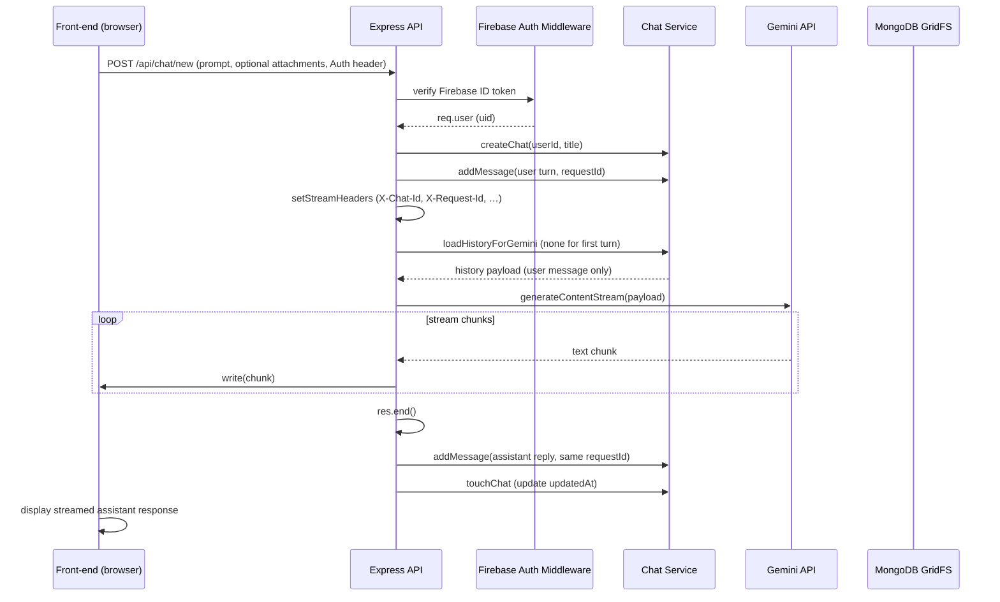

# Jerry AI Backend Architecture Documentation

## Overview

**Project name:** Jerry AI Backend

**Purpose:** Provides a RESTful API for the Jerry AI chatbot. It authenticates users via Firebase, stores chat history and file uploads in MongoDB (including GridFS for binary data), and generates AI responses using the Google Gemini generative AI model.

**Tech‑stack summary**
- Node.js (v18+ recommended)
- Express 5.2.1 – HTTP server and routing
- Mongoose 9.6.2 – ODM for MongoDB
- MongoDB + GridFS – persistent chat storage & binary file storage
- Firebase Admin SDK 12.7.0 – Firebase ID token verification and user profile sync
- @google/generative‑ai 0.24.1 – Gemini 2.0 Flash client with key rotation
- Multer 2.1.1 – multipart file uploads (in‑memory buffer)
- cors 2.8.6 – CORS handling
- dotenv 17.2.4 – environment‑variable loading

---

## Cross‑Platform Notes

This backend is written in pure Node.js and has no OS‑specific dependencies. All npm scripts that set environment variables use **cross‑env**, which works on Windows (Command Prompt, PowerShell, Git Bash), macOS, and Linux. The codebase has been tested on all three platforms and runs without modification.

---

## High‑Level Architecture Diagram

```mermaid
flowchart LR
    Client[Client (Frontend)] -->|HTTP request| Express[Express Server]
    Express -->|CORS & JSON parsing| Middleware[Middleware]
    Middleware -->|Firebase ID‑token verification| Auth[Auth Middleware]
    Auth --> Controllers[Controllers]
    Controllers --> Services[Services]
    Services --> Gemini[Google Gemini API]
    Services --> MongoDB[MongoDB (Chat & Message collections)]
    Services --> GridFS[MongoDB GridFS (File storage)]
    Services --> Firebase[Firebase Admin SDK]
    Controllers -->|Streaming response (text/plain)| Stream[Streaming response]
    style Client fill:#E3F2FD,stroke:#90CAF9,stroke-width:2px
    style Express fill:#FFF3E0,stroke:#FFB74D,stroke-width:2px
    style Auth fill:#E8F5E9,stroke:#81C784,stroke-width:2px
    style Services fill:#F3E5F5,stroke:#BA68C8,stroke-width:2px
    style Gemini fill:#FFEBEE,stroke:#E57373,stroke-width:2px
```

---

## Folder & File Structure

```
.
├─ config
│   ├─ db.js               # MongoDB connection, GridFS bucket, URI resolution
│   ├─ firebase.js          # Firebase Admin SDK initialization & env sanitisation
│   └─ gemini.js           # Gemini client factory, key rotation & retry logic
├─ controllers
│   ├─ auth.controller.js # `/api/auth/*` – profile sync and the `me` endpoint
│   ├─ chat.controller.js # `/api/chat/*` – chat CRUD, streaming, file upload
│   ├─ profile.controller.js # `/api/profile/*` – user profile CRUD & avatar upload
│   └─ stream.controller.js # generic streaming placeholder (not currently used)
├─ middleware
│   ├─ auth.middleware.js   # verifies Firebase ID token, populates req.user
│   ├─ auth.switch.js      # alias that currently just exports auth.middleware
│   ├─ firebase-auth.middleware.js (unused placeholder)
│   ├─ mongo.middleware.js  # aborts request when MongoDB is disconnected
│   ├─ upload.middleware.js # Multer memory storage, 10 MiB limit
│   └─ verifyFirebaseToken.js # low‑level token verification helper
├─ models
│   ├─ Chat.model.js       # Chat schema (sessionId UUID, title, userId, timestamps)
│   ├─ Message.model.js    # Message schema (role, content, attachments, requestId)
│   └─ User.model.js       # User profile (Firebase uid + extra fields)
├─ routes
│   ├─ auth.routes.js      # mounts on `/api/auth`
│   ├─ chat.routes.js      # mounts on `/api/chat`
│   └─ profile.routes.js   # mounts on `/api/profile`
├─ utils
│   ├─ geminiHelper.js     # fetches GridFS files and formats for Gemini SDK
│   └─ systemPrompt.js     # static system instruction for Gemini
├─ server.js                # entry point – express app, CORS, routing, health check
├─ package.json             # dependencies & scripts
├─ README.md                # high‑level project description (for developers)
└─ tests / scripts …       # test suite & auxiliary scripts (not part of API)
```

*Key files*:
- **server.js** – creates the Express app, configures CORS, attaches JSON body parser, and registers the three router groups.
- **config/** – centralises external‑service configuration (MongoDB, Firebase, Gemini) and hides secret handling.
- **middleware/auth.middleware.js** – the gatekeeper that validates Firebase ID tokens and attaches a lightweight `req.user` object used throughout the API.
- **controllers/chat.controller.js** – contains the core chat lifecycle (session creation, streaming, edit, continue, file upload, etc.).
- **services/chat.service.js** – pure business logic for chats, messages, titles and request‑id generation.
- **models/** – Mongoose schemas reflecting persisted data.

---

## Technology Stack (exact versions)

| Layer | Library / Service | Version |
|-------|-------------------|---------|
| Runtime | Node.js | ≥ 18 |
| Server | Express | 5.2.1 |
| DB ODM | Mongoose | 9.6.2 |
| DB | MongoDB (any 4.4+ compatible server) | – |
| File storage | GridFS (MongoDB feature) | – |
| Auth provider | Firebase Admin SDK | 12.7.0 |
| AI provider | @google/generative‑ai | 0.24.1 |
| File upload | Multer | 2.1.1 |
| CORS handling | cors | 2.8.6 |
| Env handling | dotenv | 17.2.4 |

---

## Authentication & Security

### Firebase ID‑Token verification
1. **Client** sends `Authorization: Bearer <Firebase‑ID‑Token>` on every protected endpoint.
2. `auth.middleware` calls `verifyFirebaseToken` which uses the **Firebase Admin SDK** to:
   - Decode the token
   - Verify its signature, expiry and revocation status
   - Return a payload containing `uid`, `email`, `name`, `picture`.
3. The middleware attaches a minimal `req.user` object (`uid`, `email`, `displayName`, `photoURL`).
4. All downstream route handlers rely on `req.user.uid` for ownership checks.

### Middleware flow (request lifecycle)
```
[Request] → CORS check → JSON body parser → auth.switch (protect) → mongo.middleware (if route needs DB) → route handler → controller → service → response
```
- The **auth.switch** module simply re‑exports `auth.middleware` – this makes future switching between auth providers trivial.
- **mongo.middleware** short‑circuits any chat‑related request when MongoDB is offline, returning HTTP 503 with a clear message.

### CORS configuration
Defined in `server.js` with a whitelist that includes:
- `http://localhost:5173` (default Vite dev server)
- `http://localhost:5174`
- The value of `FRONTEND_URL` env var (if set)
- Additional origins via `CORS_ORIGINS` (comma‑separated)
- In development mode, any `http://localhost:*` or `http://127.0.0.1:*` is allowed.
- When `ALLOW_VERCEL_PREVIEWS=true`, any `*.vercel.app` host is accepted.
- If the `Origin` header is missing (e.g., curl or mobile apps) the request is allowed.

### Environment‑variable protection
- The server loads a `.env.development` (or `.env`) file only when `NODE_ENV !== "production"`. Production environments must supply variables via the host platform.
- **Firebase private key** is sanitized in `config/firebase.js` – surrounding quotes are stripped and escaped new‑lines (`\\n`) are converted back to real line‑breaks before passing to `admin.credential.cert`.
- **MongoDB URI** handling in `config/db.js`:
  - Trims surrounding quotes
  - Allows password substitution via `MONGODB_PASSWORD` when the placeholder `<db_password>` is present.
  - Enforces a default database name (`jerry`) when the URI lacks one.
- Sensitive variables (`GEMINI_API_KEY`, `GEMINI_API_KEYS`, `FIREBASE_PRIVATE_KEY`, etc.) are never logged.

### Rate‑limiting & Gemini key rotation
- Gemini keys are supplied as a comma‑separated list (`GEMINI_API_KEYS`) or a single key (`GEMINI_API_KEY`).
- `config/gemini.js` implements **round‑robin rotation** (`getNextKey`) and a **retry wrapper** (`withRetry`).
- On a 429 (rate‑limit) or 5xx (transient) error, the wrapper logs a warning with the failing key index, then retries using the next key. The number of retries is `max(keys.length * 2, 2)`.
- Non‑retryable errors (401/403, 404, network failures) are logged with a concise diagnostic hint and bubbled up to the controller, which in turn sends a fallback response (`[Error generating response. Please try again.]`).

---

## Routers

| Router file | Base mount path | Description |
|------------|----------------|-------------|
| `routes/auth.routes.js` | `/api/auth` | User‑profile sync and the `me` endpoint (returns basic Firebase user info) |
| `routes/chat.routes.js` | `/api/chat` | All chat‑related endpoints: session creation, streaming, CRUD, file upload, search, etc. |
| `routes/profile.routes.js` | `/api/profile` | User‑profile CRUD, avatar upload, username check, session revocation |

---

## Controllers

| Controller | Exported functions (HTTP handlers) |
|-----------|------------------------------------|
| `auth.controller.js` | `getProfile(req, res)`, `syncUser(req, res)` |
| `chat.controller.js` | `uploadFile`, `getFile`, `createSession`, `createChatAndStream`, `getUserChats`, `getRecentChats`, `searchChats`, `getChatMessages`, `deleteChat`, `renameChat`, `continueChat`, `editMessage`, `updateMessage`, `deleteMessage` |
| `profile.controller.js` | `getProfile`, `updateProfile`, `deleteProfile`, `uploadAvatar`, `checkUsername`, `revokeAllSessions` |
| `stream.controller.js` | `streamResponse` (generic placeholder, not wired to any route) |

---

## Services

### `services/chat.service.js`
Provides pure, side‑effect‑free business logic used by the chat controller:
- `titleFromPrompt(prompt)` – fast, deterministic 4‑6‑word title generation without a Gemini call.
- `createChat(userId, title, sessionId?)` – persists a new Chat document.
- `createEmptySession(userId, title?)` – same as above but returns only the public representation.
- `addMessage({chatId, userId, role, content, attachments, requestId})` – persists a Message.
- `getMessages(chatRef, userId)` – ownership‑checked fetch of a chat’s messages.
- `listChats`, `searchChats`, `softDeleteChat`, `renameChat`, `assertChatOwner`, `findMessageById`, `truncateFromMessage`, `updateMessageContent`, `loadHistoryForGemini`, `newRequestId` etc.
- Helper utilities for UUID validation and for converting internal Mongo documents to a public API shape (`toPublicChat`).

### Gemini‑related logic (`config/gemini.js`)
- `getModel()` – creates a Gemini client for the current key (round‑robin).
- `withRetry(fn)` – executes a function with automatic key rotation on rate‑limit or transient errors. Logs the failing key index and diagnostic hints.

---

## Complete API Endpoints Table

| Method | Path | Auth Required | Description | Request Body | Response | Special Headers |
|--------|------|---------------|-------------|--------------|----------|-----------------|
| **GET** | `/health` | No | Health check – reports DB & Firebase connectivity | – | `{ ok, auth, firebase, mongo, chatStore, gemini, env }` | – |
| **GET** | `/` | No | Simple sanity endpoint (`"Jerry API Running"`) | – | Plain text | – |
| **GET** | `/api/auth/me` | ✅ (Firebase ID token) | Returns basic authenticated user info | – | `{ uid, email, ... }` | – |
| **POST** | `/api/auth/sync` | ✅ (Firebase ID token) | Upserts a user profile in MongoDB based on the Firebase UID | – | Full user document | – |
| **GET** | `/api/profile/` | ✅ (Firebase ID token) | Fetch combined Firebase + stored profile | – | User document | – |
| **PUT** | `/api/profile/` | ✅ (Firebase ID token) | Update mutable profile fields (`fullName`, `username`, `bio`, `phone`, `socialLinks`, `photoURL`) | `{ fullName?, username?, bio?, … }` | Updated user document | – |
| **DELETE** | `/api/profile/` | ✅ (Firebase ID token) | Soft‑delete the profile (Mongo document removal) | – | `{ message: "Profile deleted" }` | – |
| **POST** | `/api/profile/avatar` | ✅ (Firebase ID token) | Upload avatar image (multer, 10 MiB limit) – stores a placeholder URL | multipart `file` | `{ photoURL, user }` | – |
| **GET** | `/api/profile/username-available?username=...` | ✅ (Firebase ID token) | Checks if a username is already taken | – | `{ available: true|false }` | – |
| **POST** | `/api/profile/revoke-sessions` | ✅ (Firebase ID token) | Placeholder – would revoke all Firebase sessions | – | `{ message: "All sessions revoked (placeholder)" }` | – |
| **POST** | `/api/chat/session` | ✅ (Firebase ID token) | Create an empty chat session (no messages) – useful for URL‑first UX | `{ title?: string }` | `{ id, sessionId, title, createdAt, updatedAt }` | – |
| **POST** | `/api/chat/new` | ✅ (Firebase ID token) | Create a new chat, store the first user message, **stream** Gemini response. Returns streaming text and sets response headers `X-Chat-Id`, `X-Session-Id`, `X-Request-Id`, `X-User-Message-Id`. | `{ prompt: string, attachments?: [], sessionId?: string }` | Streaming `text/plain` – final assistant message persisted server‑side | `X-Chat-Id`, `X-Session-Id`, `X-Request-Id`, `X-User-Message-Id` |
| **POST** | `/api/chat/upload` | ✅ (Firebase ID token) | Upload a file (image, PDF, etc.) to GridFS. | multipart `file` | `{ fileId, url, mimeType, name }` | – |
| **GET** | `/api/chat/files/:fileId` | No (public) – the file itself is stored in GridFS and access is controlled by the route’s `requireMongo` middleware only. | Stream the requested file from GridFS | – | Binary stream (`Content-Type` based on stored mime) | – |
| **GET** | `/api/chat/all` | ✅ (Firebase ID token) | List **all** chats for the authenticated user (most recent first) | – | `[ { id, sessionId, title, createdAt, updatedAt } … ]` | – |
| **GET** | `/api/chat/recent` | ✅ (Firebase ID token) | List the **most recent** 10 chats (limit configurable via `?limit=`) | – | Same shape as `/all` (truncated) | – |
| **GET** | `/api/chat/search?q=...&limit=…` | ✅ (Firebase ID token) | Text search on chat titles (full‑text if Mongo text index exists) | – | Same shape as `/all` (search results) | – |
| **GET** | `/api/chat/:chatId` | ✅ (Firebase ID token) | Retrieve all messages belonging to the chat identified by a public `sessionId` **or** legacy Mongo ObjectId | – | `{ chat: {...}, messages: [{ id, role, content, attachments, requestId, createdAt, … }] }` | Response headers: `X-Chat-Id`, `X-Session-Id`, `X-Chat-Title` |
| **DELETE** | `/api/chat/:chatId` | ✅ (Firebase ID token) | Soft‑delete a chat and all its messages | – | `{ message: "Chat deleted" }` | – |
| **PATCH** | `/api/chat/:chatId/rename` | ✅ (Firebase ID token) | Rename the chat (auto‑title generation is bypassed) | `{ title: string }` | Updated chat representation | – |
| **POST** | `/api/chat/:chatId/continue` | ✅ (Firebase ID token) | Append a new user turn to an existing chat and **stream** the Gemini reply. Headers identical to `/new`. | `{ prompt: string, attachments?: [] }` | Streaming text (assistant response) | `X-Chat-Id`, `X-Session-Id`, `X-Request-Id`, `X-User-Message-Id` |
| **PUT** | `/api/chat/:chatId/edit/:messageId` | ✅ (Firebase ID token) | Edit a previously‑sent **user** message, truncate all later messages, and stream a new assistant reply. | `{ prompt: string, attachments?: [] }` | Streaming text (assistant response) | Same streaming headers as `/new` |
| **PATCH** | `/api/chat/:chatId/message/:messageId` | ✅ (Firebase ID token) | Update a message **in‑place** (no re‑generation). Typically used to add/remove attachments after the fact. | `{ content?: string, attachments?: [] }` | Updated message JSON `{ id, role, content, attachments, requestId }` | – |
| **DELETE** | `/api/chat/:chatId/message/:messageId` | ✅ (Firebase ID token) | Delete a single message (assistant or user). The chat’s `updatedAt` timestamp is refreshed. | – | `{ message: "Message deleted", id: "..." }` | – |

---

## Data Models

### User (`User.model.js`)
| Field | Type | Description |
|-------|------|-------------|
| `uid` | String (required, unique) | Firebase UID – ownership key for chats/messages |
| `clerkId` | String (optional, unique, sparse) | Legacy ID from a previous auth provider |
| `externalId` | String (optional, sparse) | Legacy external identifier |
| `username` | String (required) | Public username displayed in the UI |
| `email` | String (required, unique) | Email address (lower‑cased) |
| `fullName` | String (optional) | Full name of the user |
| `bio` | String (optional, max 500) | Short user biography |
| `phone` | String (optional) | Phone number |
| `socialLinks` | Sub‑document (`twitter`, `linkedin`, `github`, `website`) | Optional social profile URLs |
| `photoURL` | String (optional) | URL to the avatar image (or placeholder) |
| `avatarFileId` | String (optional) | GridFS file ID if the avatar is stored in GridFS |
| `deletedAt` | Date (optional) | Soft‑delete marker |
| `password` | String (optional, select:false) | Legacy password field – never used for auth |
| timestamps | `createdAt`, `updatedAt` (auto) | Standard Mongoose timestamps |

### Chat (`Chat.model.js`)
| Field | Type | Description |
|-------|------|-------------|
| `sessionId` | String (UUID, unique, sparse) | Public identifier used in URLs (`/c/:sessionId`). Generated lazily for legacy rows. |
| `userId` | String (required) | Firebase UID of the owner |
| `title` | String (required) | Auto‑generated from the first prompt (or manually renamed) |
| `deletedAt` | Date (optional) | Soft‑delete flag – excluded from list queries |
| timestamps | `createdAt`, `updatedAt` | Auto‑managed by Mongoose |

### Message (`Message.model.js`)
| Field | Type | Description |
|-------|------|-------------|
| `chatId` | ObjectId (ref Chat, required) | Parent chat document |
| `requestId` | String (optional) | Public turn ID (`X-Request-Id`), used for deep‑linking (`?rid=`) |
| `userId` | String (required) | Firebase UID of the author |
| `role` | Enum `['user','assistant','system']` (required) | Who sent the message |
| `content` | String (required) | Text payload |
| `attachments` | Array of sub‑documents (`fileId`, `url`, `mimeType`, `name`) | Optional file references (GridFS IDs) |
| timestamps | `createdAt`, `updatedAt` | Auto‑managed |

---

## Chat Flow (Detailed)

### 1. New Chat Flow (`POST /api/chat/new`)
1. **Authorization** – `protect` middleware validates Firebase token.
2. **Request parsing** – expects `prompt` (string) and optional `attachments` array.
3. **Title generation** – `chatService.titleFromPrompt(prompt)` extracts the first 4‑6 words to create a human‑readable title.
4. **Chat document** – `chatService.createChat(userId, title, possibly‑provided‑sessionId)` creates a `Chat` record (generates a UUID if none supplied).
5. **User message** – `chatService.addMessage` persists the user turn, records a generated `requestId`.
6. **Response headers** – `setStreamHeaders` adds `X-Chat-Id`, `X-Session-Id`, `X-Request-Id`, `X-User-Message-Id` and disables caching.
7. **Gemini request** – `formatHistoryForGemini` builds the initial payload (`role: user`, `parts: [{text: prompt}]`).
8. **Streaming** – `streamAssistant` calls `withRetry` → `model.generateContentStream` and writes each chunk to `res` as it arrives.
9. **Fallback handling** – on Gemini errors the stream writes a fallback message and the controller also persists a placeholder assistant message so the UI can recover on reload.
10. **Persistence of assistant reply** – once the stream finishes, the full assistant response is stored with `chatService.addMessage` and the chat’s `updatedAt` timestamp is refreshed.

### 2. Continue Chat Flow (`POST /api/chat/:chatId/continue`)
1. Same auth & request‑validation steps as *New Chat*.
2. **Ownership check** – `chatService.assertChatOwner(chatId, userId)` verifies the caller owns the chat.
3. **Persist user turn** – identical to step 5 above.
4. **Load history** – `chatService.loadHistoryForGemini` fetches the full ordered list of messages for the chat.
5. **Convert to Gemini parts** – `formatHistoryForGemini` includes any attachments.
6. **Streaming** – identical to step 8 above, using the full history payload.
7. **Persist assistant reply** – same as step 10.

### 3. Edit Message Flow (`PUT /api/chat/:chatId/edit/:messageId`)
1. Auth + ownership verification (same as *Continue*).
2. **Locate target message** – `chatService.findMessageById` ensures the message exists and belongs to the chat.
3. **Validate role** – only `role === 'user'` messages may be edited; otherwise a 400 error is returned.
4. **Truncate chat** – `chatService.truncateFromMessage` deletes every message **after** the edited one, effectively rewinding the conversation.
5. **Update message content** – `chatService.updateMessageContent` writes the new prompt/attachments.
6. **Preserve requestId** – the original `requestId` (or a newly generated one) is kept so the client can still reference the turn.
7. **Reload full history** – now includes the edited user message and all preceding assistant messages.
8. **Streaming** – identical to *New Chat*; the assistant response is streamed using the revised history.
9. **Persist new assistant reply** – as in other flows.

### 4. Streaming Response Handling (common code)
- `setStreamHeaders` sets:
  - `X-Chat-Id` / `X-Session-Id` – the public chat identifier.
  - `X-Request-Id` – unique turn identifier for deep‑linking.
  - `X-User-Message-Id` – the Mongo `_id` of the user turn (used by the front‑end to pair the optimistic UI message with the streaming response).
- `Content-Type: text/plain; charset=utf-8`
- `Cache-Control: no-cache, no-transform`
- `X-Accel-Buffering: no` (disables upstream buffering for real‑time streaming).
- The controller writes each chunk as soon as Gemini yields it; when the stream ends `res.end()` is called.
- The front‑end displays the streamed text as it arrives, providing a responsive UX.

### 5. Auto‑Title Generation
Implemented in `chat.service.titleFromPrompt`. It:
- Normalises whitespace, trims the prompt.
- Takes the first **six** words (or fewer) and appends an ellipsis if the original prompt is longer.
- Limits the title to 80 characters.
- Guarantees a non‑empty fallback of "New chat".

---

## File Upload (GridFS)
1. **Route** – `POST /api/chat/upload` (protected, `requireMongo`).
2. **Multer** – `upload.single('file')` stores the entire file in memory (`buffer`).
3. **Bucket** – `getGridFSBucket()` provides a GridFS bucket named `uploads`.
4. **File naming** – `Date.now()` + original filename → e.g., `1694779201234_image.png`.
5. **Upload stream** – a readable stream from the in‑memory buffer is piped to `bucket.openUploadStream` with metadata (`originalName`, `userId`).
6. **On finish** – responds with JSON containing:
   - `fileId` – the generated ObjectId string
   - `url` – the API endpoint to stream the file (`/api/chat/files/<fileId>`)
   - `mimeType`
   - `name`
7. **Error handling** – any upload error returns HTTP 500 with a message.

**File serving** (`GET /api/chat/files/:fileId`):
- Validates the ObjectId, looks up the file in GridFS, sets appropriate `Content-Type` & `Content-Disposition: inline` headers, and streams the file to the response.
- Returns 404 if the file does not exist, or 400 for an invalid ID.

---

## Environment Variables
| Variable | Required? | Description |
|----------|----------|-------------|
| `PORT` | No (default 5000) | Port on which Express listens. |
| `GEMINI_API_KEYS` | **Yes** (or `GEMINI_API_KEY`) | Comma‑separated list of Gemini API keys for rotation. |
| `GEMINI_API_KEY` | Alternative to `GEMINI_API_KEYS` | Single Gemini key. |
| `GEMINI_MODEL` | No (default `gemini-3.5-flash`) | Gemini model name to use. |
| `FRONTEND_URL` | No (used for CORS whitelist) | Base URL of the front‑end client. |
| `CORS_ORIGINS` | No | Additional comma‑separated origins allowed for CORS. |
| `ALLOW_VERCEL_PREVIEWS` | No (`false` by default) | When `true`, any `*.vercel.app` host is accepted. |
| `MONGODB_URI` | **Yes** | MongoDB connection string (may contain `<db_password>` placeholder). |
| `MONGODB_PASSWORD` | Optional | Password to substitute into `MONGODB_URI` when placeholder is present. |
| `MONGODB_DB_NAME` | Optional (default `jerry`) | Database name if the URI does not specify one. |
| `FIREBASE_PROJECT_ID` | **Yes** | Firebase project identifier. |
| `FIREBASE_CLIENT_EMAIL` | **Yes** | Service‑account client email for Admin SDK. |
| `FIREBASE_PRIVATE_KEY` | **Yes** | PEM‑encoded private key (escaped `\\n` handling). |
| `NODE_ENV` | No (default empty) | Determines dev vs production behaviour for `.env` loading. |
| `LOG_LEVEL` | No | Not presently used, but can control internal `console` verbosity. |

---

## Error Handling & Reliability
### Gemini Key Rotation & Retry (`config/gemini.js`)
- The `withRetry` wrapper attempts the request with each configured API key in a round‑robin fashion.
- On **429** (rate‑limit) or **5xx** (transient) error the wrapper logs a warning that includes the failing key index and retries with the next key.
- After `max(keys.length * 2, 2)` attempts it throws the last error, which bubbles up to the controller.
- Controllers catch the error, log it, and write a user‑visible fallback (`[Error generating response. Please try again.]`).
- The fallback is also persisted as an assistant message so the chat history stays consistent.

### General API Errors
- All controllers wrap their logic in `try/catch`. Unexpected errors result in a **500** response with `{ message: error.message }`.
- Validation errors (e.g., missing token, invalid ObjectId) return **400** or **401** with a clear message.
- Ownership/authorization failures return **403**.
- File‑related errors (upload, download) return **400**, **404**, or **500** as appropriate, always with a JSON `message`.
- The health endpoint (`/health`) surfaces the status of MongoDB, Firebase configuration, and Gemini configuration, which aids in monitoring.

---

## Mermaid Sequence Diagram – New Chat + Streaming



---

## Document metadata

_Last updated_: **2026‑09‑18**  
_Architecture document version_: **1.0**
